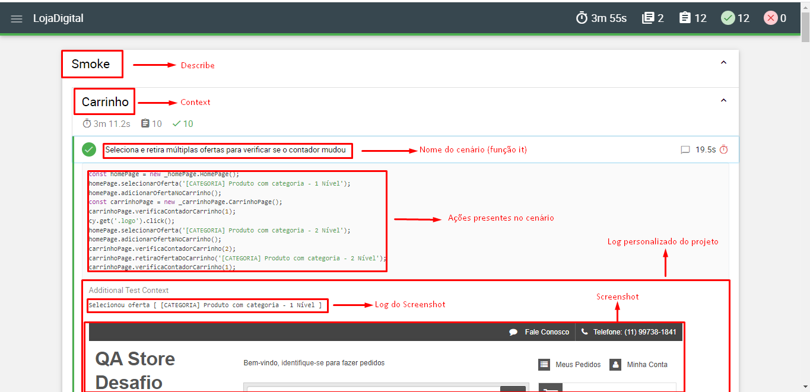

## Pré-requisitos para rodar o projeto:
-   Node: 18.13.0

## Instalando o projeto
Para instalar o projeto, basta utilizar o comando `npm install` para instalar todas as dependências.

## Rodando o projeto
### Com a interface gráfica do cypress
        npm run cypress:open

### Rodando com o mochawesome (headless mode) e gerando o relatório:
        npm run test

## Relatórios
Ao rodar com o comando `npm run test`, o projeto criará um relatório com a ferramenta mochawesome. 
Para ver o relatório, basta abrir o arquivo localizado em `cypress/reports/mochareports/report.html` .

### Relatório + imagem
Para que seja possível observar as imagens do relatório, é necessário que esteja com a ferramenta **live server** ou similar instalada e, no arquivo `cypress/reports/mochareports/report.html`, clicar com o botão direito do mouse e abrir com a ferramenta. Após abrir o relatório com a ferramenta, basta abrir os logs e observar as imagens:

## Evidências
Como todo software está sujeito a intermitências, dê uma olhada no relatório `cypress/evidencias/mochareports/reports.html`: Esta é uma cópia do último "run" antes da entrega do projeto, para que você possa ver antes de rodar ou em caso de algum cenário não passar, as evidências estão salvas.

### Relatório do mocha
O relatório do mocha fica no caminho `cypress/evidencias/relatorio/report.html`

### Videos
Para ver os videos do último run, assim como os relatórios salvos do último, basta acessar o diretório `cypress/evidencias/videos`. Aqui você encontrará dois vídeos: **negativos.spec.cy.js** e **smoke.spec.cy.js**. O primeiro refere-se aos testes da seção **Casos de Testes realizando ações mapeadas que resultam comportamentos inesperados (Negativos)** do documento **estudo-de-casos-de-testes.pdf**,  enquanto que o segundo, trata sobre a seção **Casos de Testes realizando ações mapeadas (Smoke)** do mesmo.

## Cenários de testes no código vs Caso de Testes (BDD)
Para saber qual teste corresponde ao BDD do documento **estudo-de-casos-de-teste.pdf**, basta copiar o nome de um cenário e pesquisar entre os arquivos **smoke.spec.cy.js** e **negativos.spec.cy.js**, lembrando que os BBDs da seção "Casos de Testes realizando ações mapeadas (Smoke)" se encontram no arquivo **smoke.spec.cy.js** e os BDDs presentes na seção "Casos de Testes realizando ações mapeadas que resultam
comportamentos inesperados (Negativos)", no arquivo **negativos.spec.cy.js**.

## Referências: 

https://dev.to/bushraalam/using-mochawesome-reporter-with-cypress-54pf

https://stackoverflow.com/questions/65702340/how-to-view-cy-log-output-in-mochawesome-html-report